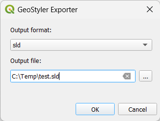

# geostyler-qgis-plugin

A QGIS Plugin for exporting layer styles to different formats.

**Experimental**




To test clone the repository and create a symlink pointing to your QGIS plugins directory

Windows Command Prompt:

```
mklink /D "%APPDATA%\QGIS\QGIS3\profiles\default\python\plugins\geostyler" "C:\GitHub\geostyler-plugin\geostyler"
```

PowerShell:

```ps
$AppDataPath = [Environment]::GetFolderPath("ApplicationData")
$SourcePath = "C:\GitHub\geostyler-plugin\geostyler"
$LinkPath = Join-Path -Path $AppDataPath -ChildPath "QGIS\QGIS3\profiles\default\python\plugins\geostyler"

# Create symbolic link
New-Item -ItemType SymbolicLink -Path $LinkPath -Target $SourcePath
```

Bash (untested):

```
ln -s /path/to/source /home/username/.local/share/QGIS/QGIS3/profiles/default/python/plugins/geostyler
```

The plugin relies on [geostyler-cli](https://github.com/geostyler/geostyler-cli) - GeoStyler's command-line tool.
This needs to be available on the system path, or placed in the plugin folder.

Binary releases are available on the release pages, for example [3.1.5](https://github.com/geostyler/geostyler-cli/releases/tag/v3.1.5).