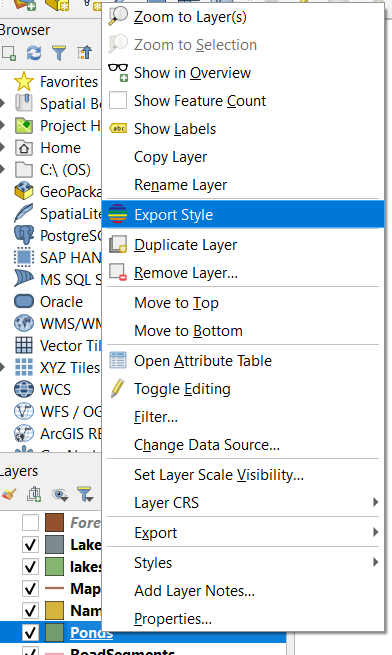

# geostyler-qgis-plugin

A QGIS Plugin for exporting layer styles to different formats.

**Experimental**

Tested with QGIS 3.34. 

**Warning**: In previous versions of QGIS (e.g. 3.24) the XML used to store
styles in QGIS projects is in a different format that is not compatible with
newer versions of the [geostyler-qgis-parser](https://github.com/geostyler/geostyler-qgis-parser) (see this [issue](https://github.com/geostyler/geostyler-qgis-parser/issues/455)). 

## Installation

To test clone the repository, create a symlink pointing to your QGIS plugins directory, and get a prebuild copy of `geostyler-cli`.
First clone the project.

```
git clone https://github.com/geostyler/geostyler-qgis-plugin C:\GitHub\geostyler-qgis-plugin
```

Next find the location of the QGIS plugins folder. You can find this in QGIS under Settings > User Profiles > Open Active Profile Folder.
This folder should contain a `python` folder. The `python` folder should contain a `plugins` folder. If this has not yet been created you
can create it manually.

Next we create a symbolic link to make the cloned GitHub repository appear in the QGIS plugins folder:

Windows Command Prompt:

```bat
mklink /D "%APPDATA%\QGIS\QGIS3\profiles\default\python\plugins\geostyler" "C:\GitHub\geostyler-qgis-plugin"
```

PowerShell:

```ps
$AppDataPath = [Environment]::GetFolderPath("ApplicationData")
$SourcePath = "C:\GitHub\geostyler-qgis-plugin\geostyler"
$LinkPath = Join-Path -Path $AppDataPath -ChildPath "QGIS\QGIS3\profiles\default\python\plugins\geostyler"

# Create symbolic link
New-Item -ItemType SymbolicLink -Path $LinkPath -Target $SourcePath
```

Bash (untested):

```bash
ln -s /path/to/source /home/username/.local/share/QGIS/QGIS3/profiles/default/python/plugins/geostyler
```

You should now be able to open Plugins > Manage and Install Plugins and find the GeoStyler plugin, and add it to QGIS.


The plugin relies on [geostyler-cli](https://github.com/geostyler/geostyler-cli) - GeoStyler's command-line tool.
This needs to be available on the system path, or placed in the plugin folder.

Binary releases are available on the [release pages](https://github.com/geostyler/geostyler-cli/releases), for example [4.3.1](https://github.com/geostyler/geostyler-cli/releases/tag/v4.3.1).

**Note** the minimum required version of GeoStyler to work with the plugin
is **4.3.1**.

Example script in PowerShell:

```ps
$zipUrl = "https://github.com/geostyler/geostyler-cli/releases/download/v4.3.1/geostyler-win.exe.zip"
$destinationPath = "C:\GitHub\geostyler-qgis-plugin\geostyler"
$zipFile = "$destinationPath\geostyler-win.exe.zip"

Write-Host "Downloading ZIP file..."
Invoke-WebRequest -Uri $zipUrl -OutFile $zipFile

# Unzip the contents
Write-Host "Unzipping contents..."
Expand-Archive -Path $zipFile -DestinationPath $destinationPath -Force
```

Check that the program runs successfully on the command line:

```
cd C:\GitHub\geostyler-qgis-plugin\geostyler
./geostyler --version
# v4.3.1
```
Now start QGIS and when right-clicking on vector or raster layers you should see the GeoStyler option in the context menu.

## Plugin Usage

Right-click on a vector or raster layer and select "Export Style":



Now you can choose the output format and output file location:


## Development

* The plugin skeleton code was created using "Plugin Builder 3".
* "Plugin Reloader" was used to reload code following modifications.
* [Debug VS](https://github.com/lmotta/debug_vs_plugin/wiki) was used to debug the plugin using Visual Studio Code. 

    * Start QGIS
    * Plugins > Enable Debugging for VS
    * In VS Code - Attach 
    * See also [Instructions](https://gist.github.com/AsgerPetersen/9ea79ae4139f4977c31dd6ede2297f90) and [Windows Guide](https://gist.github.com/NicolaiLolansen/acfd8723720c4761aefef3cdfc2aa55a).


